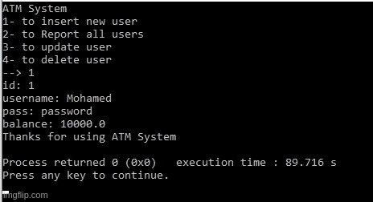

### Crud OOP Based Console ATM System I implemented in First Year College

  

### `User Interface`
Including the Four Crud Operations : Insert, Report, Update and Delete.  

### `Inserting`
UserName, Password and Balance.  

### `Reporting`
UserName, Password and Balance For All Users.  

### `Updating`
Selecting UserID.
If user is found, you may insert new user data.  

### `Deleting`
Selecting UserID.
If user is found, you may delete user data.  

### `Wrong User Insertion`
Program will execute with message to the error user.  

