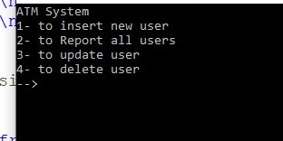

# Crud OOP Based Console ATM System I implemented in First Year College

1- User Interface :
Including the Four Crud Operations : Insert, Report, Update and Delete.  
  

2- Inserting:
UserName, Password and Balance.  
  

3- Reporting:
UserName, Password and Balance For All Users.  
  

3- Updating:
Selecting UserID.
If user is found, you may insert new user data.  
  

4- Deleting:
Selecting UserID.
If user is found, you may delete user data.  
  

5- Wrong User Insertion:
Program will execute with message to the error user.  

